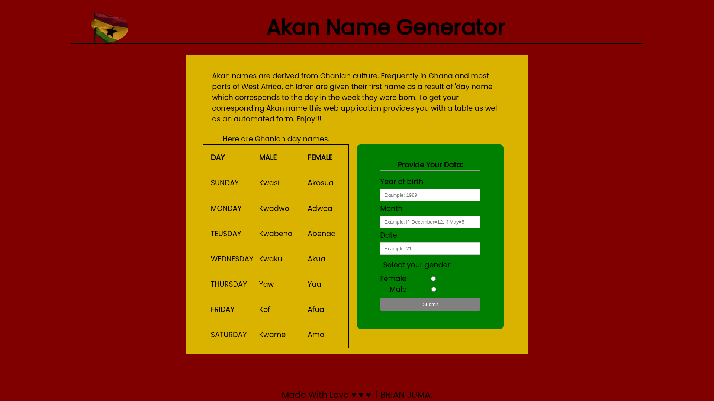
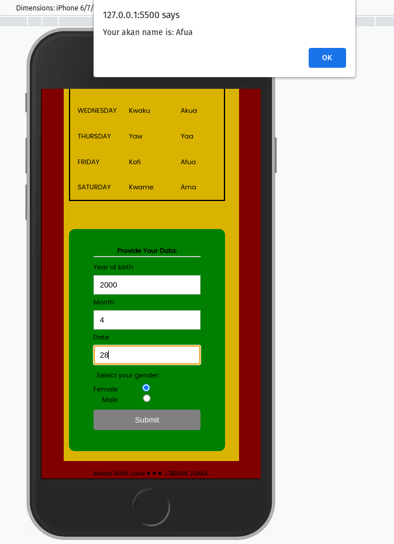

# akanName-generator

## Project Description
I built a web application that captures a user's birth date and from that data calculates the day of the week they were born i.e( Monday, Teusday, Wednesday, Thursday, Friday, Saturday or Sunday) and then with combination of the user's gender it outputs their Akan name alternative. 
 
Akan names are derived from Ghanian culture. Frequently in Ghana, children are given their first name as a 'day name' which corresponds to the day in the week they were born. Here are Ghanian day names.
 
MALE: Sunday: Kwasi| Monday: Kwadwo| Teusday: Kwabena| Wednesday: Kwaku| Thursday: Yaw| Friday: Kofi| Saturday: Kwame.
 
FEMALE: Sunday: Akosua| Monday: Adwoa| Teusday: Abenaa| Wednesday: Akua| Thursday: Yaa| Friday: Afua| Saturday: Ama.
 

## Installation and Set-up
Here is a run through of how to set up the application
* Step 1 : Clone this repository using **`git clone https://github.com/jumaBrian/akanName-generator.git**, or downloading a ZIP file of the code.
* Step 2 : The repository, if downloaded as a .zip file will need to be extracted o your preferred location and opened
* Step 3 : Open the index.html file to view the application on your preferred web browser
## Other Usage / Live link
* Get access to the Internet/Browser.
* Click on live link provided : https://jumabrian.github.io/akanName-generator/
## Built With
* HTML.
* CSS.
* Javascript.
* JQuery.

## Tests
I ran some data to see if i would get a result back.

## Author
jumaBrian 

 
Contact me via Email: njengabrianj@gmail.com

## License 
The project is served under the MIT LICENSE copyright &copy; 2022 jumaBrian.
View <a href="https://github.com/jumaBrian/akanName-generator/blob/main/LICENSE">license</a>

